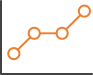

Her vises statistikk og vekst for åpen tilgang i Norge. Tjenesten viser primært
nasjonal, sektoriell og disiplinær vekst over tid fordelt på de forskjellige
typene åpen tilgang som finnes. Det samme tallgrunnlaget ligger til grunn for
[Tilstandsrapporten for høyere utdanning](https://www.regjeringen.no/no/tema/utdanning/hoyere-utdanning/tilstandsrapport-for-hoyere-utdanning/id2600317/)
og [Indikatorrapporten](https://www.forskningsradet.no/indikatorrapporten/), som publiseres årlig.

Tallene for åpen tilgang er knyttet til rapporteringstidspunktet for Norsk
vitenskapsindeks (NVI), som er klart i april hvert år. Barometeret er basert
på data fra Nasjonalt vitenarkiv.

## OA-barometeret er delt inn i fire seksjoner

```{=html}
<div class="os-cards">
  <a class="os-card" href="nasjonal-oversikt.html">
    
    <span class="os-card-title">Nasjonal oversikt</span>
    <p>Tall for alle sektorer samlet.</p>
  </a>
  <a class="os-card" href="sektoriell-oversikt.html">
    
    <span class="os-card-title">Sektoriell oversikt</span>
    <p>Tall for universitets- og høgskolesektoren, helsesektoren og instituttsektoren.</p>
  </a>
  <a class="os-card" href="disiplinaer-oversikt.html">
    
    <span class="os-card-title">Disiplinær oversikt</span>
    <p>Inndelt i de fire hoveddisiplinene.</p>
  </a>
  <a class="os-card" href="institusjonell-oversikt.html">
    
    <span class="os-card-title">Institusjonell oversikt</span>
    <p>Oversikt over norske forskningsutførende institusjoner (tabell).</p>
  </a>
</div>
```

Les mer om hvordan status for åpen tilgang blir kalkulert i vår
[metodebeskrivelse](metode.html).

::: {.os-band .column-screen}
::: {.os-band-inner}
## Eksterne lenker

```{=html}
<div class="os-cards">
  <a class="os-card" href="https://www.regjeringen.no/no/tema/utdanning/hoyere-utdanning/tilstandsrapport-for-hoyere-utdanning/id2600317/">
    <span class="os-card-title">Tilstandsrapport for høyere utdanning</span>
  </a>
  <a class="os-card" href="https://www.forskningsradet.no/indikatorrapporten/">
    <span class="os-card-title">Indikatorrapporten</span>
  </a>
</div>
```

:::
:::
